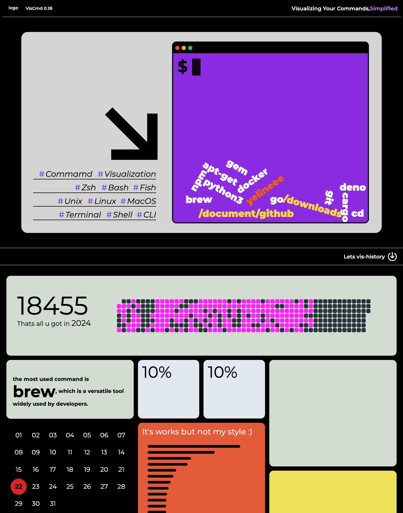

# Viscmd-demo
Hey, where's my logo? Oh, I still forgot to make it... nvm,it's fine being empty here
## Introduction
visCmd 是一个关于命令历史记录的网站，提供了一种直观的方式来查看和分享一年来的命令历史记录。这个想法始于 24 年 1 月，直到 9 月才开工，希望一年工期25Q4能完成吧hh。属于是一直想做的一个 slim project，有整体计划，开发纯看心情
<br><br>
一切的灵感来源于cmd-wrapped && Pinterest 🤔🤔🤔



#### visCmd 注重以下方面
- 色彩搭配
- 交互设计
- 用户体验
- 数据可视化
- 安全

#### visCmd 将带来的功能
- 命令行历史记录的可视化
- 年度总结卡片
- 流畅的动画效果
- 优质的用户交互体验
- 数据安全保障
- 不同shell支持 

## Timeline

### 24Q0（24.9 — 25.1）
- 草稿级别的demo，实现部分基础功能 ✅
- 整理下放上github ✅
- logo设计
- readme完善

### 25Q1（25.1 — 25.3）
- 继续打磨
- 第一次小规模的分享
- 构思下mv

## Main Dependencies

- Vue 3
- Vue Router
- Pinia
- Tailwind CSS
- Vite
- Vitest
- Matter.js
- Day.js
- html2canvas


## Project Setup
```sh
# Install the dependencies
npm install

# Run the development server
npm run dev
```

## Main Dependencies

- Vue 3
- Vue Router
- Pinia
- Tailwind CSS
- Vite
- Vitest
- Matter.js
- Day.js
- html2canvas

## License

This project is licensed under the MIT License. See the [LICENSE](LICENSE) file for details.